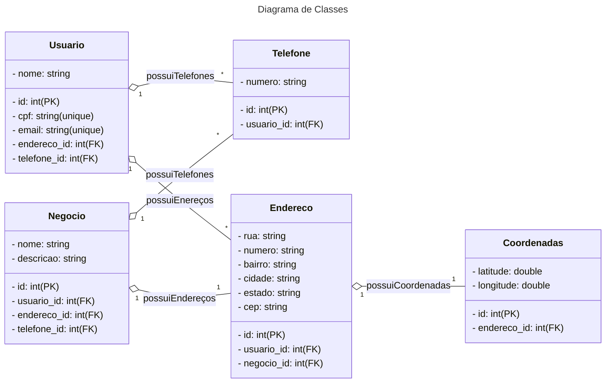

# Santander Bootcamp 2023 - Fullstack Java+Angular

Projeto do **Santander Bootcamp 2023 - Fullstack Java+Angular** do qual eu fiz uma RESTful API de para ser consumida por algum pseudo site ou outro tipo de projeto que tenha um cadastro de usuários do qual esse usuário pode cadastrar o seu negócio para ser exibido em alguem meio de consumo da API (um site por exemplo).
O usuário faz seu cadastro e em seguida pode ou não associar um negócio ao seu cadastro (perfil).

- [API na Nuvem para Usar](https://bsd-2023-api-prd.up.railway.app/swagger-ui.html)
- [Site da Railway (Usado para disponibilizar na Nuvem)](https://railway.app/)
- [Github do Projeto Original da DIO](https://github.com/falvojr/santander-dev-week-2023)

## Aluno

- [Ágryo DIO](https://www.dio.me/users/agryo)
- [Ágryo LinkedIn](https://www.linkedin.com/in/agryo/)

## Modelos JSON para usar na API

- [Modelo de Usuário](https://github.com/agryo/Bootcamp-Santander-2023/blob/main/src/main/resources/assets/Usuario.json)
- [Modelo de Negócio](https://github.com/agryo/Bootcamp-Santander-2023/blob/main/src/main/resources/assets/Negocio.json)
- [Modelo de Alterar Usuário](https://github.com/agryo/Bootcamp-Santander-2023/blob/main/src/main/resources/assets/Update.json)

## Diagrama de Classes (Domínio da API)

## Links Úteis

- [Mermaid - Diagramas de Classe](https://mermaid.js.org/)
- [OpenAPI - Swegger](https://github.com/springdoc/springdoc-openapi)

### Dica

- Caso dê problema com a porta 8080, veja se a porta está ocupada com o comando `netstat -ano | findstr :8080`, caso esteja, veja o código e derrube com o comando `taskkill /F /PID 12345` (substitua o 12345 é o código).
