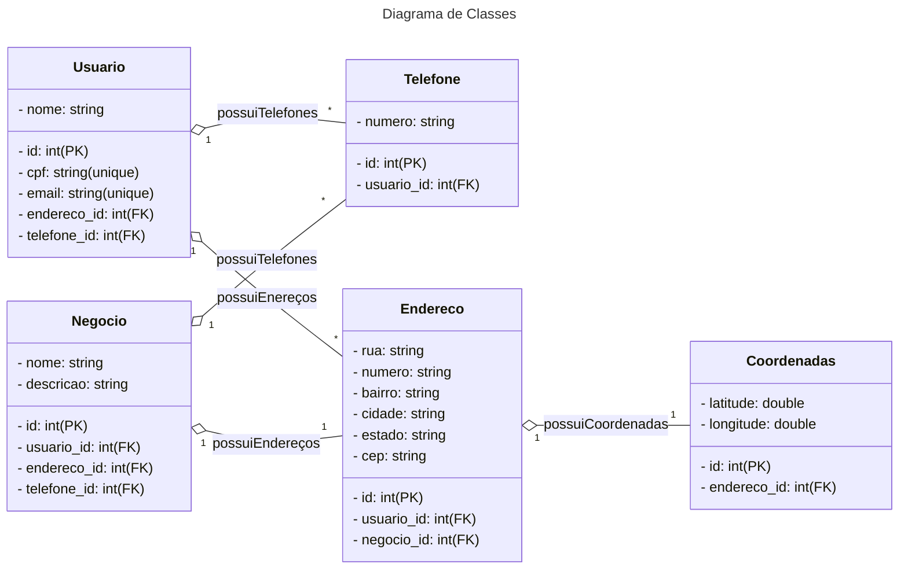

# Santander Bootcamp 2023 - Fullstack Java+Angular

## Aluno
- [Ágryo DIO](https://www.dio.me/users/agryo)
- [Ágryo LinkedIn](https://www.linkedin.com/in/agryo/)

## Diagrama de Classes (Domínio da API)

## Links Úteis
- [Mermaid - Diagramas de Classe](https://mermaid.js.org/)